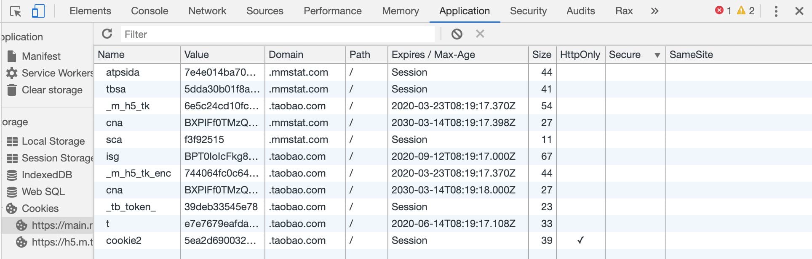

## cookie

### Cookie 的设置
那 Cookie 是怎么设置的呢？简单来说就是

客户端发送 HTTP 请求到服务器
当服务器收到 HTTP 请求时，在响应头里面添加一个 Set-Cookie 字段
浏览器收到响应后保存下 Cookie
之后对该服务器每一次请求中都通过 Cookie 字段将 Cookie 信息发送给服务器。

#### Set-Cookie示例
名字为`id`，内容为`a3fWa`，过期时间`Wed, 21 Oct 2015 07:28:00 GMT`

`Set-Cookie: id=a3fWa; Expires=Wed, 21 Oct 2015 07:28:00 GMT;`

#### Expires

当 Expires 属性缺省时，表示是会话性 Cookie，像上图 Expires 的值为 Session，表示的就是会话性 Cookie。当为会话性 Cookie 的时候，值保存在客户端内存中，并在用户关闭浏览器时失效。

需要注意的是，有些浏览器提供了会话恢复功能，这种情况下即使关闭了浏览器，会话期 Cookie 也会被保留下来，就好像浏览器从来没有关闭一样。

与会话性 Cookie 相对的是持久性 Cookie，持久性 Cookies 会保存在用户的硬盘中，直至过期或者清除 Cookie。这里值得注意的是，设定的日期和时间只与客户端相关，而不是服务端。

#### Max-Age
Max-Age 用于设置在 Cookie 失效之前需要经过的秒数。比如：
`Set-Cookie: id=a3fWa; Max-Age=604800;`
Max-Age 可以为正数、负数、甚至是 0。

如果 max-Age 属性为正数时，浏览器会将其持久化，即写到对应的 Cookie 文件中。

当 max-Age 属性为负数，则表示该 Cookie 只是一个会话性 Cookie。

当 max-Age 为 0 时，则会立即删除这个 Cookie。

假如 Expires 和 Max-Age 都存在，Max-Age 优先级更高。

#### Domain
Domain 指定了 Cookie 可以送达的主机名。假如没有指定，那么默认值为当前文档访问地址中的主机部分（但是不包含子域名）。

像淘宝首页设置的 Domain 就是 .taobao.com，这样无论是 a.taobao.com 还是 b.taobao.com 都可以使用 Cookie。

在这里注意的是，不能跨域设置 Cookie，比如阿里域名下的页面把 Domain 设置成百度是无效的：